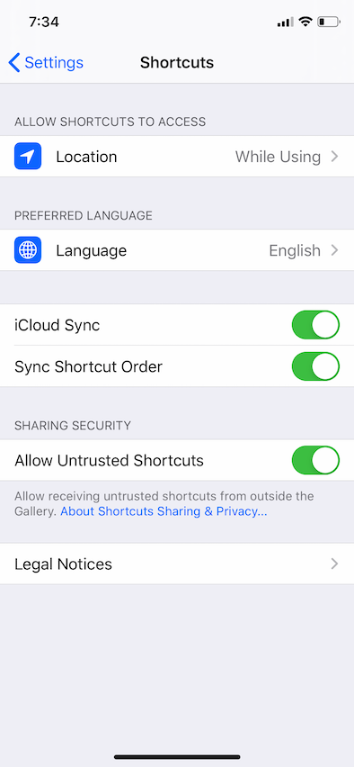
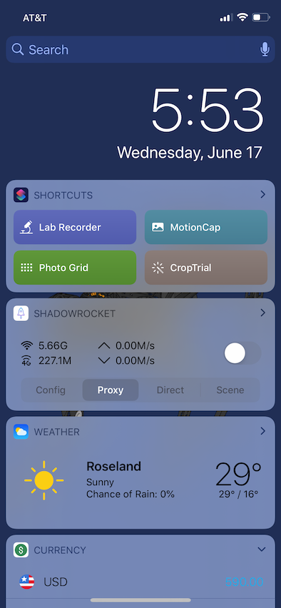

# Lab Recorder workflow
`by Shenggao Li` `Shortcuts` `iOS`

## What's Lab Recorder
**Lab Recorder** can help you record your entry or exit event by just one click. And also open Notre Dame’s [Certification of Wellness](https://docs.google.com/forms/d/e/1FAIpQLSce_PBA1jQEp30HwN58U3obeNEseJGCdwml0e6RdRkAh2Rfrg/viewform?entry.1507624637=Wensing+Lab&entry.929597546=YOURLASTNAME&entry.922046923=YOURFIRSTNAME&entry.1268015247=None+of+the+above+-+I+feel+well) form with your information (require unlock iPhone). You can directly click submit (if you feel well).
Lab Recorder base on [Shortcuts](https://apps.apple.com/us/app/shortcuts/id915249334) app in **iOS** (recommend iOS 12+).

> [Shortcuts](https://apps.apple.com/us/app/shortcuts/id915249334) is a free app from Apple and should be pre-installed on every iOS devices. If it’s not pre-installed on your iPhone/iPad, please click the link to app store and install it \[[Shortcuts](https://apps.apple.com/us/app/shortcuts/id915249334)\].

## How to use Lab Recorder
### Allow untrusted shortcuts
To import Lab Recorder, you need allow untrusted shortcuts. You can find the “Allow Untrusted Shortcuts” toggle botton in Settings/Shortcuts.

> If you **never used Shortcuts before**, you have to create a workflow in Shortcuts with any action (or add a random one from the gallery) then run it. **After the first run** you can now toggle on the “Allow Untrusted Shortcuts” option.

### Import Lab Recorder
By clicking the [Lab Recorder](https://www.icloud.com/shortcuts/1adb30e986e640049369fa4777c9cc61), you can load it into the Shortcuts app. **Then you have to follow the instruction filling your information. (important)**

Now the “**Lab Recorder**” workflow should appears in the today widget, you can click it manually every time you arrive or leave the lab.
Or long press the Lab Recorder in app, under share menu you can add it to your home screen.

